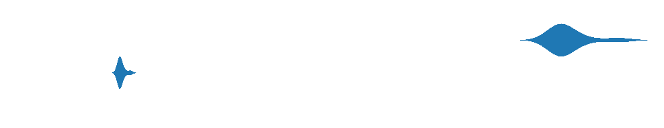
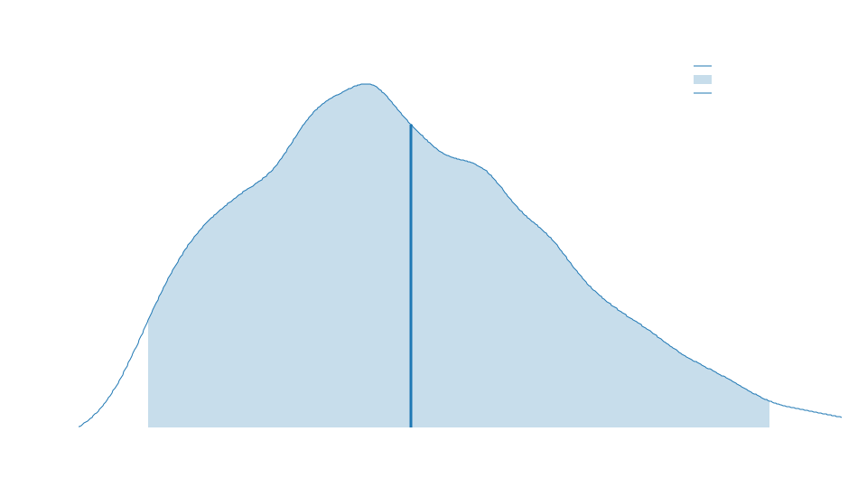
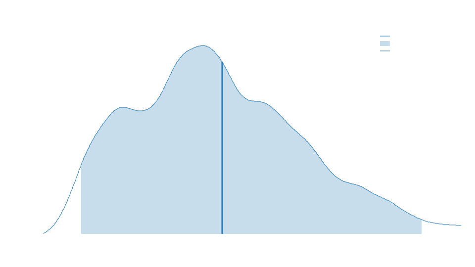

# Turbopack Vs Webpack

```json
// turbo.json
{
    "pipeline": {
        "build": {
            "outputs": [
                ".next/**"
            ]
        },
        "lint": {
            "outputs": []
        }
    }
}
```

```json
// package.json
{
  "scripts": {
    "build": "npx next build",
    "build:turbo": "npx turbo build"
  },
  "dependencies": {
    "next": "^12.3.1",
    "react": "^17.0.2"
  },
  "devDependencies": {
    "@types/node": "^14.0.0",
    "@types/react": "^17.0.34",
    "turbo": "^1.6.2",
    "typescript": "^4.4.4"
  }
}

```

```
cargo bench
```

## Simple Next.js Benchmarks 



## npx turbo build
---


## npx next build
---

